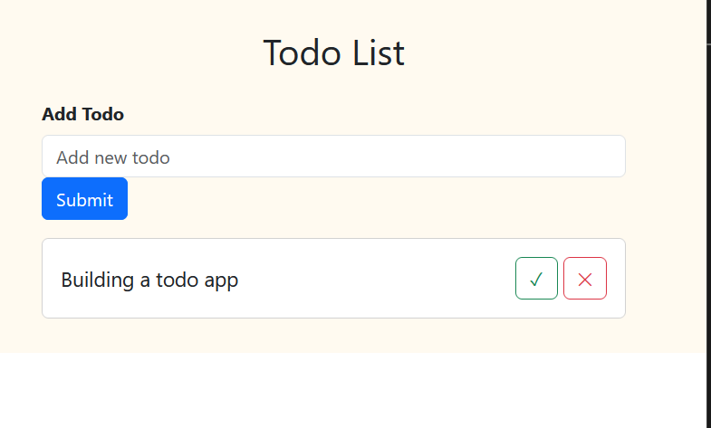

## Todo List App

A simple Todo List app built using React and Bootstrap. This app allows users to add items, mark as completed, and delete items in the todo list. It has an input form where the item can be added and submitted. At the back end, a function is used to push is used to update the the item into the Hook. Other functions involve a boolean function to determine if the item is marked complete and delete function to remove the any particular item from the list

# Live demo link

[Live version](https://testreact-hhi5.onrender.com)

# Screenshot of the Project

# Highlight

- Add new item to the todo list
- click on mark item button
- click on delete button from the list

# Stacks

- ReactJs
- Bootstrap

* Javascript

# Getting Started with the project

- git clone https://github.com/folusosamuel/testReact.git

- cd into testReact

- run npm install

- run npm start to view in browser

# Author

## **Foluso Samuel Makinde**

- Github: https://github.com/folusosamuel
- Twitter: https://twitter.com/@folusosamuel
- Linkedin: (www.linkedin.com

This project is [MIT](LICENSE) licensed.
